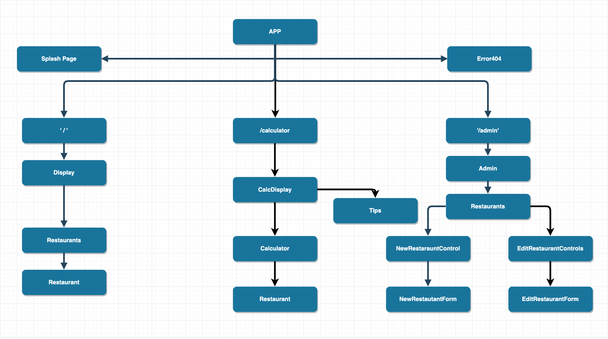
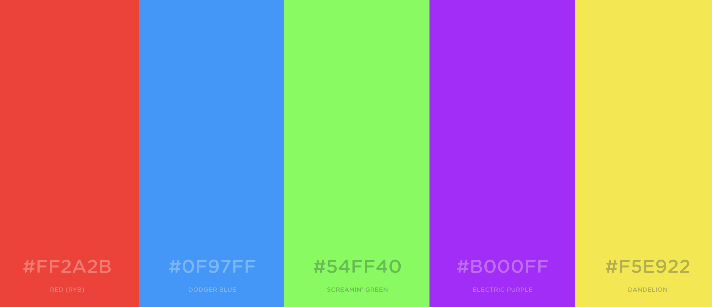

# Sushi Go-around Calculator
#### May 3, 2019

## Description

_Sushi Go-around Calculator allows the user to add the amount per plate color they've grabbed from the conveyor belt. The application will then calculate the total price and default tip total. The user will also be allowed to customize a tip percentage._

## MVP

- [ ] Display Restaurant information ( _Name, Location & Hours_ )
- [ ] List Restaurants that are only open
- [ ] CSS Styling on plates ( _blue, red, green, yellow, purple, etc_ )
- [ ] Functions to calculate total
- [ ] Splash page to welcome users
- [ ] CSS Animations
- [ ] Functions to Calculate Tips
- [ ] Firebase data for Conveyor belt sushi restaurants ( _name: , location: , hours: , plateColors: price, open:_ )

## Stretch Goals

- [ ] Pin location on map
- [ ] Display "Happy Hour" information
- [ ] Functions to calculate total during "Happy Hour" (custom/automatic default tips)
- [ ] Randomizer to select a restaurant for user

## Project Drafts

Component Tree | Color Scheme
 ---------- | ----------
 | 

## Tools/Resources

* Firebase
* Google API
* ATOM

* https://css-tricks.com/set-text-on-a-circle/

## Frameworks, Libraries, Languages

* HTML
* CSS
* React

## Setup on OSX

* Install Node.js
* Install karma-cli globally:
  * `$ npm install -g karma-cli`

* Clone project into desktop
  * `$ git clone https://github.com/MalyPhong619/sushi-calculator.git`

###### Inside root directory

* Install Dependecies
  * `$ npm install`

* To build
  * `$ npm run build`

* To start the dev server
  * `$ npm run start`

## Support and contact details

_If there are any questions please feel free to email [Maly Phongsavanh](mailto:maly@maly.dev)_

### License
_This software is licensed under the MIT license_
Copyright (c) 2019 **_Maly Phongsavanh_**
